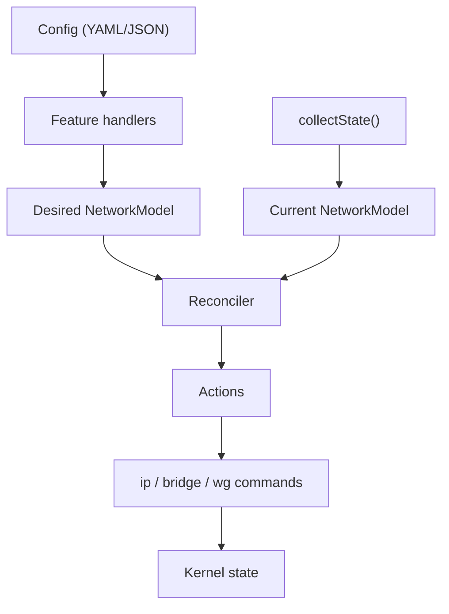

# CompartiNET

Experimental reactive network manager for Linux, written in TypeScript. Manages network namespaces, bridges, veth pairs, WireGuard interfaces, routes, addresses, VLANs, and DHCP — all driven by a declarative YAML or JSON configuration.

**This is experimental, it is not ready for production use.**

## Key Features

- **Network namespaces** — create, delete, and move interfaces between namespaces
- **Bridges** — with 802.1Q VLAN filtering, STP control, and per-port VLAN membership
- **veth pairs** — virtual Ethernet links within or across namespaces
- **WireGuard** — interface creation and full configuration (peers, keys, endpoints, keepalive)
- **Hardware matching** — declare expected physical interfaces by PCI bus/device ID
- **DHCP client** — automatic IPv4 lease acquisition with renewal and rebinding
- **Wake-on-LAN** — send WoL magic packets via the `compartinet wol` command
- **systemd integration** — `sd_notify` readiness, SIGHUP config reload, periodic state drift detection
- **YAML/JSON configuration** — single file or a directory, validated against a JSON Schema

## How It Works

CompartiNET uses a **desired-state vs current-state reconciliation** pattern:

1. **Desired state** is built from your declarative configuration (YAML/JSON). Feature handlers (netns, bridge, veth, WireGuard, DHCP, etc.) expand the config into a `NetworkModel` — a structured representation of namespaces, interfaces, addresses, and routes.

2. **Current state** is collected from the kernel by polling `iproute2` JSON output, `wg showconf`, `bridge vlan show`, `iw dev`, and `ss`.

3. **Reconciliation** diffs the two models and produces a sequence of `ip`, `bridge`, `wg`, and `sysctl` commands to converge the current state toward the desired state.

4. **Commands** are executed, and the cycle repeats every 30 seconds to catch drift.

## Quick Start

```bash
# Install globally from npm
npm install -g compartinet

# Check current state (network model)
compartinet state

# Install the systemd service
sudo compartinet install

# Create a configuration based on the current state
compartinet state-config | sudo tee /etc/compartinet/config.d/network.yaml

# Start the service
sudo systemctl enable --now compartinet
```

## Configuration Example

```yaml
# /etc/compartinet/config.d/network.yaml

- type: CreateNamespace
  netns: apps

- type: CreateBridge
  netns: apps
  iface: br0
  vlanFiltering: true

- type: CreateVeth
  netns: apps
  iface: veth0
  peerNetns: ""
  peerIface: veth-apps

- type: AddBridgePort
  netns: apps
  iface: veth0
  bridge: br0

- type: AddIpAddress
  netns: apps
  iface: br0
  ip:
    family: ipv4
    address: 10.0.0.1
    prefixLength: 24

- type: SetInterfaceUp
  netns: apps
  iface: br0
  up: true

- type: CreateWireguard
  netns: apps
  iface: wg0

- type: SetWireguardConfig
  netns: apps
  iface: wg0
  config:
    privateKey: "..."
    listenPort: 51820
    peers:
      - publicKey: "..."
        allowedIPs:
          - family: ipv4
            address: 10.0.0.2
            prefixLength: 32
        endpoint: "peer.example.com:51820"
        persistentKeepalive: 25
```

See [sampleConfig.yaml](sampleConfig.yaml) for a complete annotated reference of all available features.

## Installation

### From npm (recommended)

```bash
npm install -g compartinet
```

The package bundles all dependencies. Requires Node.js.

### From source

```bash
git clone https://github.com/davdiv/compartinet.git
cd compartinet
npm ci
npm run build:node
# The built executables are in dist/
```

## Architecture



- **[src/common/](src/common/)** — platform-agnostic model, feature system, reconciler, DHCP protocol parsing
- **[src/node/](src/node/)** — Linux state collection, command execution, CLI tools, systemd integration
- **[tests/unit/](tests/unit/)** — pure-logic tests (reconciler, model generation, DHCP protocol)
- **[tests/integration/](tests/integration/)** — end-to-end tests running real `ip`, `wg`, and `bridge` commands

## Development

**Prerequisites:** Node.js, Docker (for integration tests)

```bash
npm ci

# Type-check, build, test, lint, format — all at once:
npm run full-check

# Individual commands:
npm run type-check       # TypeScript type checking
npm run build:node       # Build the dist/ output
npm run test:unit        # Run unit tests
npm run test:integration # Run integration tests (in Docker container)
npm run lint             # ESLint
npm run format:check     # Check formatting
npm run format:fix       # Fix formatting
```

Integration tests run inside a privileged Docker container (`--cap-add=NET_ADMIN --cap-add=SYS_ADMIN`) built from [tests/container/Dockerfile](tests/container/Dockerfile). You can also open an interactive shell in the test container:

```bash
npm run sandbox
```

## License

[MIT](LICENSE.md) — Copyright 2026 DivDE
